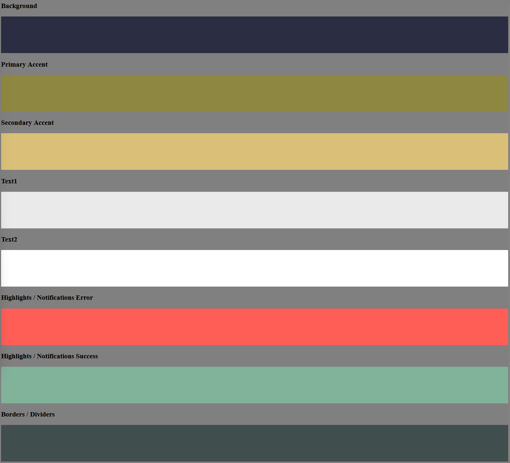

# RuneTask

RuneTask is a simple, users-friendly to-do list web app built with Django. Users can create, manage and track their goals with the option to link their current runescape character details in order to keep track of their goals. This project was created as part of my Code Institute 16 week bootcamp course. The aim is to use the Django framework to create a full-stack project which is hosted on Heroku. There must be a custom database table and the app must provide some CRUD functionality.

_img_

Live site: _link_

Admin access link: _link_

GitHub repository: _link_

## Table of Contents

1. [RuneTask Introduction](#RuneTask)
2. [How To Use The App](#how-to-use-the-app)
3. [UX - User Experience](#ux---user-experience)
    - [Accessibility and Responsiveness](#accessibility-and-responseiveness)
    - [Colour Palette](#colour-palette)
    - [Fonts](#fonts)
4. [Project Planning](#project-planning)
    - [Agile](#agile)
    - [Wireframe](#wiresframes)
    - [MosCoW](#moscow)
    - [User Stories](#user-stories)
    - [Entity Relationship Diagram](#entity-relationship-diagram)
5. [Security](#security)
6. [Features](#features)
7. [Future Features](#future-features)
8. [Technology and Languages](#technology-and-languges)
    - [Languages](#languages)
    - [Frameworks](#frameworks)
    - [Tools and Programs](#tools-and-programs)
9. [Testing](#testing)
    - [Validation Testing](#validation-testing)
    - [User Testing](#user-testing)
    - [Automated Testing](#automated-testing)
10. [Deployment](#deployment)
    - [GitHub](#github)
    - [Django](#django)
    - [Cloudinary](#cloudinary)
    - [PostgreSQL](#postgresql)
    - [Heroku](#heroku)
    - [Clone](#clone)
    - [Fork](#fork)
11. [Credits](#credits)

## How to use the app

Using the app is simple! Unregistered users can stay on the homepage to view tasks which registered users have made public. However, to start working with the app you must register. 

Click the 'Sign Up' link in the navigation bar to create and account. Once this step is complete you can start making lists. Navigate to the 'Profile' link and press the 'New Task' button. Here you can specify what skill you are planning to train, outline what steps you must take (using the rich text editor) and choose whether to make the list public or keep it private.

For even greater functionality you can use the 'link character' button feature to safely use runescape's own Oldschool Hiscrores API to retrieve details about your character. Doing this allows your profile to display your current stats which you can incorporate into the task list. 

If you feel like customising you profile feel free to choose from a range of provided profile images.

When you've completed your task you can edit the task list and mark it as complete. Feel free to upload a screenshot of your success!

## UX - User Experience

### Accessibility and Responseiveness

_Discuss the accessibility and responsiveness of the app._

### Colour Palette

Given the oldschool, medieval and MMO related nature of the app I chose mostly dark and earth tones for my app. I chose white and off white for the text to maintain readability for users. I asked chatGPT to generate additional colours which suited the palette for positive and negative buttons.

### Fonts

For the fonts I chose  Metamorphous - Designed by James Grieshaber from GoogleFonts - This suited my medieval style with its serifs but is still quite readable. 

I decided to use the alternative font Roboto - Designed by Christian Robertson for areas where I thought the readability was particularly important such as buttons and notification messages.

## Project Planning

### Agile

This project was created using the agile methodology, particularly in relation to creating granular user stories which streamlines the development process. All of these user stories were gathered into a project kanban board on GitHub where I could pull stories from the backlog to the in progress column. Once I had completed the tasks they were moved into the completed column.  

_img of project board_

### User Stories

_All user stories marked with could should might and wont_

### MoSCoW

All of the user stories I created were sorted using the MoSCoW (Must have, Should Have, Could Have and Wont Have) prioritisation system. This system allowed me to organise my userstories, making sure that all the must haves formed my minimum viable product. Once those were completed I could advance towards including my Should and Could have user stories which would provide extra features for the user and lead to a more finished product. My wont have stories outlines features which were not in the scope of this development cycle but helped me to keep a focus on where the project is leading.

_MoSCow examples images_

### Wiresframes

The wire framing for this project was done using the free trial of [wireframe.cc](https://wireframe.cc/). 

### Entity Relationship Diagram

The entity relationship diagram for this project was created using [SmartDraw](https://www.smartdraw.com/)

## Security

Fortunately Django contains a lot of inbuilt security features such as CSRF protection, the encrypted storage of passwords and the ability to create a superuser to manage and control what data is entered into the public site. 

This last point was particulary importand for my project as I have a public area where users can post their to-do lists to the home page. The superuser abilites mean that I am able to approve or deny public lists before they are posted to the homepage and thus ensure that there is no sensitive or offensive content. 
