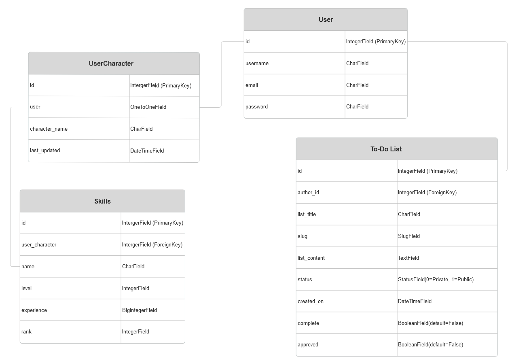
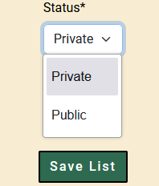

# RuneTask

RuneTask is a simple, users-friendly to-do list web app built with Django. Users can create, manage and track their goals with the option to link their current runescape character details in order to keep track of their goals. This project was created as part of my Code Institute 16 week bootcamp course. The aim is to use the Django framework to create a full-stack project which is hosted on Heroku. There must be a custom database table and the app must provide CRUD functionality.

_img of display on multiple devices_

Live site: [RuneTask](https://rune-task-6f978e78a585.herokuapp.com/)

Admin access link: [RuneTask Admin](https://rune-task-6f978e78a585.herokuapp.com/admin/login/?next=/admin/)

GitHub repository: [GitHub RuneTask](https://github.com/Code-Dearman/Django-Capstone)

GitHub project board: [RuneTask Project](https://github.com/users/Code-Dearman/projects/4/views/1)

## Table of Contents

1. [RuneTask Introduction](#RuneTask)
2. [How To Use The App](#how-to-use-the-app)
3. [UX - User Experience](#ux---user-experience)
    - [Accessibility and Responsiveness](#accessibility-and-responseiveness)
    - [Colour Palette](#colour-palette)
    - [Fonts](#fonts)
4. [Project Planning](#project-planning)
    - [Agile](#agile)
    - [Wireframe](#wiresframes)
    - [MosCoW](#moscow)
    - [User Stories](#user-stories)
    - [Entity Relationship Diagram](#entity-relationship-diagram)
5. [Security](#security)
6. [Features](#features)
7. [Future Features](#future-features)
8. [Technology and Languages](#technology-and-languges)
    - [Languages](#languages)
    - [Frameworks](#frameworks)
    - [Tools and Programs](#tools-and-programs)
9. [Testing](#testing)
    - [Validation Testing](#validation-testing)
    - [User Testing](#user-testing)
10. [Deployment](#deployment)
    - [GitHub](#github)
    - [Django](#django)
    - [PostgreSQL](#postgresql)
    - [Heroku](#heroku)
    - [Clone](#clone)
    - [Fork](#fork)
11. [Credits](#credits)

## How to use the app

Using the app is simple! Unregistered users can stay on the homepage to view tasks which registered users have made public. However, to start working with the app you must register. 

Click the 'Sign Up' link in the navigation bar to create and account. Once this step is complete you can start making lists. Navigate to the 'Profile' link and press the 'Create New List' button. Here you can outline the steps you must take (using the rich text editor), choose whether to make the list public or keep it private and finally mark it as complete (if you've finished it of course!).

If you make a mistake or decide that you no longer want to use this list you can edit or delete it by accessing the list through your profile and pressing the 'edit' or 'delete' links.

If you want to view one list in closer detail simply press or click on the heading and it will take you to a view of just that list. 

For even greater functionality you can use the 'link character' button feature to safely use runescape's own Oldschool Hiscrores API to retrieve details about your character. Doing this allows your profile to display your current stats which you can incorporate into the task list. 


## UX - User Experience

### Accessibility and Responseiveness

_Discuss the accessibility and responsiveness of the app and choices such as buttons and organisation._

I began my design process using mobile first principles. The choice of bootrap was essential in that it allowed me to create a grid structure on all the pages which, when enlarged to desktop size would scale to fit the available space. As with many websites there are certain breakpoints where the scaling doesn't work in the way it should (see below for example) however I found that on the whole the project maintains a cohesive look throughout.

<br>
<details>
<summary>Scaling issue (click to expand)</summary>

</details>
<br>

User interface choices such as buttons were decided upon during development as I went though a range of colour and shape choices. On the whole I tried to stay with a 'red for negative' and 'green for positive' theme and this is the most recognisable. I stayed away from using too many ':hover' effects as I found that this didn't suit my semi-retro style choice. 

<br>
<details>
<summary>Buttons (click to expand)</summary>

</details>
<br>

In terms of organisation I found the layout developed quite organically. The user is presented with a home page where there is a short introduction, asking them to look around or create an account so start making lists. This leads the user to the login and signup buttons on the navbar at the top. Once an account has been made all other pertinent information can be found in the profile area. There are calls to action to either 'Create a new list' or 'add a character'. 

Given that this website it aimed at RuneScape players I would suggest that these features are self explanatory, other online tools offer a very similar experience where users will enter the name of their character to pull their details from the runescape API.

<br>
<details>
<summary>Call to action (click to expand)</summary>

</details>
<br>

### Colour Palette

Given the oldschool, medieval and MMO related nature of the app I chose earth tones and gold accents for my app. I chose black the text to maintain readability for users. I asked Claude AI to generate additional colours which suited the palette for positive and negative buttons.

<br>
<details>
<summary>Colour palette</summary>

</details>
<br>

Throughout the development process I regularly checked by website again online constrast checkers in order to make sure that the text was readable. 


### Fonts

For the fonts I chose  Metamorphous - Designed by James Grieshaber from GoogleFonts - This suited my medieval style with its serifs but is still quite readable. 

I decided to use the alternative font Roboto - Designed by Christian Robertson for areas where I thought the readability was particularly important such as buttons, notification messages and information paragraphs.


## Project Planning

### Agile

This project was created using the agile methodology, particularly in relation to creating granular user stories which streamlines the development process. All of these user stories were gathered into a project kanban board on GitHub where I could pull stories from the backlog to the in progress column. Once I had completed the tasks they were moved into the completed column.  


### User Stories

Listed below are the primary user stories that I created during my planing process with their relevant acceptance criteria.

**Create and account**

As a *user* I can *create an account* so that I can *log in and use the website*.

Acceptance criteria
- Sign up page checks password validity.
- Sign up page stores a registered user in the database.
- User can log in after account creation.

**Log in to account**

As a *user* I can *log in to my account* so that I can *see my saved tasks*.

Acceptance criteria
- Login form accepts valid details.
- User details are saved to database.
- Logged in users cannot access login or signup pages

**Create a new to-do list**

As a *user* I can *create a new list* so that I can *keep track of my goals*.

Acceptance criteria
- New list button generates form for to-do list creation.
- New list can be saved to the database and accessed with relevant permissions

**Delete to-do list**

As a *user* I can *delete my to-do list* so that I can *control my to-do list profile*.

Acceptance criteria
- Delete button removes task from database.
- Only lists related to the user can be deleted by said user. No cross user post deletion.
- Delete option prompts a confirmation message for the user.

**View all lists from the admin panel**

As a *superuser* I can *view all lists from the admin panel* so that I can *moderate publicly posted lists*.

Acceptance criteria
- Admin panel displays all lists.
- Lists can be organised by public and private.

**View all lists on the homepage**

As a *user* I can *view public lists on the homepage* so that I can *see what other users are up to*.

Acceptance criteria
- Display only public marked and approved lists.
- Pagination on homepage for scrolling public tasks.
- Each public task displays the relevant task information.

**Request a public list**

As a *user* I can *request that my list be made public* so that I can *share it with other users*.

Acceptance criteria
- Public button on list creation notifies admin of lists to be made public.
- Posts that are marked as public are displayed on the homepage.
- Posts can be re-marked as private in the future, removing the list from the frontpage without need for admin approval.

**Mark to-do list as completed**

As a *user* I can *mark my list as complete* so that I can *display my achievements*.

Acceptance criteria
- Editing lists includes 'complete' checkbox.
- Ticking 'complete' changes the display of the task.

**Link character to profile**

As a *user* I can *link my RuneScape character to my profile* so that I can *keep track of my stats*.

Acceptance criteria
- Entered user name requests character data from runescape API.
- Characters are saved to the user database table.
- Website section updates with character statistics.

### MoSCoW

All of the user stories I created were sorted using the MoSCoW (Must have, Should Have, Could Have and Wont Have) prioritisation system. This system allowed me to organise my userstories, making sure that all the must haves formed my minimum viable product. Once those were completed I could advance towards including my Should and Could have user stories which would provide extra features for the user and lead to a more finished product. My wont have stories outlines features which were not in the scope of this development cycle but helped me to keep a focus on where the project is leading.


### Wiresframes

The wire framing for this project was done using the free trial of [wireframe.cc](https://wireframe.cc/). 


### Entity Relationship Diagram

The entity relationship diagram for this project was created using [SmartDraw](https://www.smartdraw.com/)

During the initial planning I believed that I would have a very simple database set up with only two tables which would be related in a one to many relationship. The individual user to their many to-do lists.


Soon enough I realised I would need to include two more tables, one for each user character and another for the character skills. This was mainly due to the issues I can in applying the skills that I was receieving as a JSON response to each user. It became much more simple to create a skills table which related to each character and then relate each character to a user. 

My entity relationships ended up looking more like this.



## Security

Fortunately Django contains a lot of inbuilt security features such as CSRF protection, the encrypted storage of passwords and the ability to create a superuser to manage and control what data is entered into the public site. 

This last point was particulary importand for my project as I have a public area where users can post their to-do lists to the home page. The superuser abilites mean that I am able to approve or deny public lists before they are posted to the homepage and thus ensure that there is no sensitive or offensive content. 

## Features

__Users (click headings to expand images):__

<details>
<summary>View public lists on the homepage</summary>

</details>

<details>
<summary>Create an account</summary>

</details>

<details>
<summary>Login to their account</summary>

</details>

<details>
<summary>Create a new to-do list</summary>


</details>

<details>
<summary>View their to-do lists</summary>


</details>

<details>
<summary>Edit their to-do lists</summary>

</details>


<details>
<summary>Request their list to be made public</summary>


</details>

<details>
<summary>Link RuneScape character to their profile</summary>

</details>

<details>
<summary>Delete their to-do lists</summary>

</details>

<details>
<summary>Mark their to-do lists as completed</summary>

</details>

<br>

__Superusers (click headings to expand images):__

<details>
<summary>View all lists</summary>

</details>

<details>
<summary>Approve public list requests</summary>

</details>

<details>
<summary>Create and delete lists</summary>

</details>


## Future Features

There were a variety of features that I thought of at the beginning of the project and a couple that I thought of while it was in development. Unfortunely, I was not able to include them during this iteration but I have listed them here for future consideration.

- The ability to incoporate player levels directly into the to-do list. Allowing the list to automatically mark as done when the desired level has been reached.

- Personal images for user which would display on their profile page and next to their lists.

- Add images directly to to-do lists in order for users to share screenshots of their achievements.

- A system for notifying users when their public list requests have been approved. 

- Adding a unique image for each skill in the database so the skills grid looks more appealing.

- Further integration of the RuneScape Hiscores API. This API offers even more information which can be included in a character profile such as boss kills, clue scroll completions and minigames. 

- Character deletion so that users can add a different character or correct a mistake.

- Creating a character refresh button in the profile page so recent changes can be shown (Note: This was halfway incorporated in the UserCharacter model. The last_updated field was going to be used to check and refresh character skills.)

```
class UserCharacter(models.Model):
    """
    Model which represents one Runscape character per user.
    """
    user = models.OneToOneField(User, on_delete=models.CASCADE, related_name="character")
    character_name = models.CharField(max_length=50, unique=True)
    last_updated = models.DateTimeField(auto_now=True)

    def __str__(self):
        return self.character_name
``` 

## Technology and Languges

### Languages

The languages used for this project were:
- HTML
- CSS
- JavaScript
- Python

### Frameworks

The frameworks used for this project were:
- [Django](https://www.djangoproject.com/)
- [Bootstrap](https://getbootstrap.com/)

### Tools and Programs

Additional tools and programs used include:
- [Wireframe.cc](https://wireframe.cc/) for wireframe creation.
- [SmartDraw](https://www.smartdraw.com/) for entity relationship diagram.
- [chatGPT](https://chatgpt.com/) for general advice and insight on project planning, error checking code snippets and spell checking.
- [FontAwesome](https://fontawesome.com/) for webpage icons.
- [Googlefonts](https://fonts.google.com/) for fonts.
- [GitHub](https://github.com/) for storing repository.
- [Favicon.io](https://favicon.io/) for creating favicon.
- Git for version control
- Gitpod for writing code and pushing to repository.

## Testing

### Validation Testing

The validation testing was done using the [W3C](https://www.w3.org/) website HTML and CSS validator.

__HTML Validation__

The HTML validation was done on my deployed site. I cycled through all available pages, inputting the address into the validator and checking the results. This included, logged in and logged out users, list creation, list deletion, home page view and 

The HTML validation gave me a few errors. Some to do with semantic issues, such as wrapping *buttons* in *anchors* or putting *p* elements inside of a *span* element. Overall these issues were solved fairly quickly. However, there were lots of errors which were to do either with inserted forms which are maked as safe in the .html files or with the to-do lists themselves which are inserted from the database and also marked with safe. While I cant fix these errors I have noted them and did my best to ensure that they do not impact website. 

Error images (Click heading to expand)

<details>
<summary>Semantic errors</summary>

</details>

<br>

<details>
<summary>Form errors and examples</summary>


</details>

<br>

__CSS Validation__

The CSS validation was also done using the W3C validator. Fortunately I only used a single style sheet for my project and it presented no errors when I ran it through the validator. 

<details>
<summary>Validator image</summary>

</details>

### User Testing

Manual user testing was done by me. I made sure that I could access and perform all the neccessary features, both as user and superuser. This included:
- Making to-do lists (as user and superuser)
- Deleting to-do lists (as user and superuser)
- Requesting lists be made public (as user)
- Approving lists (as superuser)
- Linking runescape characters (as user)
- Creating new accounts (as user)

**Browser Compatablity**: The website was tested Firefox and Chrome for desktop view and Safari and Firefox for mobile view.

**Responsiveness Testing**: I tested the responsiveness of all areas of the website on both desktop and mobile phone views.

## Deployment

### GitHub

This project was created on the Gitpod CDE and Git was used for version control. The repository is stored on GitHub and was linked to Heroku for deployment.

### Django

Django was essential to the deployment process as it works seemlessly with Heroku. Adding allowed hosts in config/settings.py means that you can choose what hosts are allowed for the website. 

### PostgreSQL

_add later_

### Heroku

Deploying on Heroku was done with these steps.

- Create a new Heroku app.
- Choose GitHub as the deployment method in the app dashboard.
- For my project I did manual deployments from the main branch.
- Set the config vars in Heroku to match the vars in eny.py to protect secret keys and passwords.
- Click deploy and wait for Heroku to finishing setting up the website.

### Clone 


### Fork


## Credits

